# Schéma de base de données — BâtiBénin

Base PostgreSQL hébergée sur Supabase. Le schéma est versionné via des migrations dans `supabase/migrations/` et les types TypeScript générés dans `src/integrations/supabase/types.ts`.

## Modèle de données (diagramme ER)

```mermaid
erDiagram
    auth_users ||--o{ profiles : "1..n"
    profiles ||--o{ projects : "1..n"
    profiles ||--o{ user_roles : "1..n"
    profiles ||--o{ profile_verifications : "1..n"
    profiles ||--o{ notification_preferences : "1..1"
    profiles ||--o{ notifications : "1..n"
    profiles ||--o{ device_tokens : "1..n"
    projects ||--o{ notifications : "1..n"

    projects ||--o{ budget_lines : "1..n"
    projects ||--o{ expenses : "1..n"
    projects ||--o{ payments : "1..n"
    projects ||--o{ payment_transactions : "1..n"
    orders ||--o{ payment_transactions : "1..1"
    payments ||--o{ payment_transactions : "1..1"
    projects ||--o{ site_logs : "1..n"
    projects ||--o{ quotes : "1..n"
    projects ||--o{ documents : "1..n"
    projects ||--o{ materials : "1..n"
    projects ||--o{ material_requirements : "1..n"
    projects ||--o{ material_deliveries : "1..n"
    material_requirements ||--o{ material_deliveries : "1..n"
    suppliers ||--o{ material_requirements : "1..n"
    suppliers ||--o{ material_deliveries : "1..n"
    projects ||--o{ photos : "1..n"
    projects ||--o{ tasks : "1..n"
    projects ||--o{ invoices : "1..n"
    projects ||--o{ reserves : "1..n"
    projects ||--o{ plans : "1..n"
    projects ||--o{ messages : "1..n"

    categories ||--o{ expenses : "1..n"
    categories ||--o{ budget_lines : "1..n"
    suppliers ||--o{ expenses : "1..n"
    companies ||--o{ expenses : "1..n"
    quotes ||--o{ payments : "1..n"
    suppliers ||--o{ quotes : "1..n"
    quotes ||--o{ quote_items : "1..n"
    invoices ||--o{ invoice_items : "1..n"
    profiles ||--o{ quote_requests : "1..n"
    profiles ||--o{ quote_bids : "1..n"
    quote_requests ||--o{ quote_bids : "1..n"
    profiles ||--o{ disputes : "1..n"
    profiles ||--o{ dispute_evidences : "1..n"
    disputes ||--o{ dispute_evidences : "1..n"
    profiles ||--o{ refunds : "1..n"
    disputes ||--o{ refunds : "1..n"

    stores ||--o{ products : "1..n"
    profiles ||--o{ stores : "1..1"
    product_categories ||--o{ products : "1..n"
    products ||--o{ cart_items : "1..n"
    carts ||--o{ cart_items : "1..n"
    products ||--o{ order_items : "1..n"
    orders ||--o{ order_items : "1..n"
    orders ||--o{ deliveries : "1..1"
    drivers ||--o{ deliveries : "1..n"
    vehicles ||--o{ deliveries : "1..n"
    stores ||--o{ orders : "1..n"

    products ||--o{ product_prices : "1..n"
    products ||--o{ product_inventory : "1..n"

    projects ||--o{ project_members : "1..n"
    profiles ||--o{ project_members : "1..n"
    organizations ||--o{ organization_members : "1..n"
    profiles ||--o{ organization_members : "1..n"
    profiles ||--o{ organizations : "1..n"

    profiles ||--o{ providers : "1..n"
    providers ||--o{ provider_reviews : "1..n"
    profiles ||--o{ verification_documents : "1..n"
    profiles ||--o{ market_reviews : "1..n"
    profiles ||--o{ demo_requests : "1..n"
    profiles ||--o{ audit_logs : "1..n"
    profiles ||--o{ email_log : "1..n"
    projects ||--o{ audit_logs : "1..n"
    profiles ||--o{ invoices : "1..n"
    profiles ||--o{ invoice_payments : "1..n"
    profiles ||--o{ ai_conversations : "1..n"
    ai_conversations ||--o{ ai_actions : "1..n"
    profiles ||--o{ equipment : "1..n"
    equipment ||--o{ equipment_rentals : "1..n"
    profiles ||--o{ equipment_rentals : "1..n"
    projects ||--o{ equipment_rentals : "1..n"
    profiles ||--o{ development_programs : "1..n"
    development_programs ||--o{ buildings : "1..n"
    buildings ||--o{ property_units : "1..n"
    profiles ||--o{ property_reservations : "1..n"
    property_units ||--o{ property_reservations : "1..n"
    projects ||--o{ property_reservations : "1..n"
```

## Tables

### Gestion des comptes

| Table                      | Rôle                                                                                                                                                                                                                                                                                                                                                                             |
| -------------------------- | -------------------------------------------------------------------------------------------------------------------------------------------------------------------------------------------------------------------------------------------------------------------------------------------------------------------------------------------------------------------------------- |
| `profiles`                 | Profil utilisateur : `full_name`, `phone`, `account_type` (particulier / maitre_oeuvre / entreprise).                                                                                                                                                                                                                                                                            |
| `user_roles`               | Rôles étendus (ex. `admin`) — porte la vérification `useIsAdmin()`.                                                                                                                                                                                                                                                                                                              |
| `profile_verifications`    | Demandes de vérification d'identité des comptes.                                                                                                                                                                                                                                                                                                                                 |
| `notification_preferences` | Préférences de notification (canaux e-mail/push/SMS/WhatsApp, alertes, digest hebdomadaire) — une ligne par utilisateur.                                                                                                                                                                                                                                                         |
| `notifications`            | Notifications persistées multi-canal : `channel` (`in_app`/`email`/`push`/`sms`/`whatsapp`), `kind` (commande, livraison, paiement, devis, rapport, litige, verification, assistant), `title`, `body`, `link`, `read_at`. RLS propriétaire.                                                                                                                                      |
| `device_tokens`            | Appareils enregistrés pour le push : `token` unique par utilisateur (`user_id, token`), `platform`, `last_seen_at`. RLS propriétaire.                                                                                                                                                                                                                                            |
| `email_log`                | Journal d'envoi des notifications.                                                                                                                                                                                                                                                                                                                                               |
| `equipment`                | Matériel à louer : nom, catégorie, marque/modèle, ville, `daily_price`, `weekly_price`, `deposit` (caution), `quantity`, `condition` (excellent/bon/moyen/mauvais), `status` (disponible/loue/hors_service). RLS : catalogue lisible par tous les connectés, écriture propriétaire.                                                                                              |
| `equipment_rentals`        | Location de matériel : matériel, client, chantier, `start_date`/`end_date`, tarifs figés, `total_price`, `deposit`, `deposit_paid`, **paiement intégral** `total_paid`/`total_paid_at` (mobile money, hors caution), livraison (`delivery_fee`, `delivery_address`, `scheduled_at`), `return_code` (remise QR), `returned_at`, `status` (demande → confirmee → en_cours → retour_en_cours → terminee, + annulee/litige). RLS : client + propriétaire du matériel. |
| `development_programs`     | Programme immobilier : promoteur, nom, description, ville/adresse, `status` (planification/commercialisation/en_construction/livre), `budget_total` (objectif de ventes), dates. RLS : lecture tous connectés, écriture promoteur.                                                                                                                                               |
| `buildings`                | Immeuble d'un programme : `program_id`, nom, `floor_count`, `status`. RLS : écriture via le promoteur du programme.                                                                                                                                                                                                                                                              |
| `property_units`           | Lot/appartement : `building_id`, étage, référence (`label`), `unit_type` (appartement/villa/boutique/bureau/terrain/garage/magasin), `surface_m2`, pièces, salles de bain, `price`, `status` (disponible/reserve/vendu). RLS : écriture via le promoteur.                                                                                                                        |
| `property_reservations`    | Dossier client (réservation/vente) : `unit_id`, auteur, chantier, nom/téléphone/email du client, `amount`, `deposit_paid` (acompte), notes, `status` (demande → confirmee → vendue, + annulee). Confirmer → lot `reserve`, vendre → lot `vendu`, annuler → lot `disponible`. RLS : auteur + promoteur du programme.                                                              |
| `demo_requests`            | Demandes d'accès à la démo commerciale.                                                                                                                                                                                                                                                                                                                                          |

### Chantiers & suivi

| Table                           | Rôle                                                                                                                                |
| ------------------------------- | ----------------------------------------------------------------------------------------------------------------------------------- |
| `projects`                      | Chantiers : nom, localisation, surfaces, budget global, dates. **V11 t2** : `lat`/`lng` (géolocalisation, carte projets).           |
| `categories`                    | Postes de dépenses (standards + personnalisés par utilisateur).                                                                     |
| `budget_lines`                  | Répartition budgétaire par catégorie et phase.                                                                                      |
| `expenses`                      | Dépenses : date, libellé, catégorie, fournisseur, entreprise, montant FCFA, paiement.                                               |
| `payments`                      | Paiements (comptant, acompte, partiel, solde) et échéances.                                                                         |
| `payment_transactions`          | **Vague 3** : transactions mobile money (montant, opérateur, numéro, statut, référence, `transaction_id`, `raw_response`).          |
| `quotes`                        | Devis fournisseurs, comparaison, conversion en commande.                                                                            |
| `quote_items`                   | **Vague 3/4** : lignes de devis (designation, `quantity` numeric, `unit`, `unit_price`), FK `quotes`.                               |
| `quote_requests`                | **Vague 5** : besoin décrit par un particulier (titre, description, dom, budget min/max, ville, échéance, statut, `winner_bid_id`). |
| `quote_bids`                    | **Vague 5** : offre chiffrée d'un prestataire (montant, message, statut), FK `quote_requests`.                                      |
| `disputes`                      | **Vague 5** : litige ouvert (référence, objet, description, type, montant, statut, décision de médiation).                          |
| `dispute_evidences`             | **Vague 5** : preuves déposées sur un litige (note, `file_path`).                                                                   |
| `refunds`                       | **Vague 5** : remboursement émis (montant, méthode, statut, référence), FK `disputes`.                                              |
| `invoices` / `invoice_payments` | Facturation et règlements associés.                                                                                                 |
| `invoice_items`                 | **Vague 3/4** : lignes de facture (designation, `quantity` text, `unit`, `unit_price`), FK `invoices`.                              |
| `site_logs`                     | Journal de chantier (commentaires, avancement, difficultés).                                                                        |
| `documents`                     | Pièces : plans, permis, actes, factures, contrats, garanties (bucket `documents`).                                                  |
| `materials`                     | Stock & matériaux.                                                                                                                  |
| `material_requirements`         | **Vague 3** : besoins en matériaux d'un chantier (prévu / commandé / livré / consommé, statut).                                     |
| `material_deliveries`           | **Vague 3** : livraisons de matériaux liées au chantier et au besoin.                                                               |
| `photo`                         | Photos de chantier.                                                                                                                 |
| `tasks`                         | Tâches & planning avec échéances.                                                                                                   |
| `reserves`                      | Réserves de fin de chantier (statut, priorité, échéance).                                                                           |
| `plans`                         | Fichiers de plans (bucket `documents`, chemin `plans/{user}/{project}/…`).                                                          |
| `messages`                      | Conversation partagée par chantier.                                                                                                 |

### Marketplace (Phase 1)

| Table                                 | Rôle                                                                                                                                                                           |
| ------------------------------------- | ------------------------------------------------------------------------------------------------------------------------------------------------------------------------------ |
| `stores`                              | Boutiques gérées par les vendeurs (1-1 avec un profil) ; géolocalisation `lat`/`lng`, **Vague 11** : `delivery_radius_km` (rayon de livraison, carte `StoreMap`).              |
| `product_categories`                  | Catégories de produits (gérées par les admins).                                                                                                                                |
| `products`                            | Produits : nom, prix FCFA, unité, stock, catégorie, boutique.                                                                                                                  |
| `product_prices`                      | **Vague 2** : historique des prix (trigger sur `products.price`).                                                                                                              |
| `product_inventory`                   | **Vague 2** : mouvements de stock (vente, réassort, ajustement, retour, annulation).                                                                                           |
| `carts` / `cart_items`                | Paniers d'achat.                                                                                                                                                               |
| `orders` / `order_items`              | Commandes (statut workflow complet). `orders.lat`/`lng` (coordonnées de livraison).                                                                                           |
| `drivers` / `vehicles` / `deliveries` | Livraison : transporteurs, véhicules, planning. **V11 t2** : `deliveries.current_lat`/`current_lng`/`position_updated_at` (suivi temps réel sur carte).                        |
| `providers` / `provider_reviews`      | Annuaire des prestataires BTP (13 domaines) et avis (flag `verified`). **V11 t2** : `lat`/`lng` (recherche « près de moi », carte).                                                |
| `market_reviews`                      | **Vague 6** : avis étendus boutique/produit/transporteur (`target_type` + `target_id`), flag `verified`, contrainte `UNIQUE (user_id, target_type, target_id)` anti-faux avis. |
| `verification_documents`              | **Vague 6** : documents de vérification soumis par les professionnels (type, statut `en_attente/approuve/rejete`, note admin, réviseur).                                       |

### IA (Vague 7)

| Table              | Rôle                                                                                                                                        |
| ------------------ | ------------------------------------------------------------------------------------------------------------------------------------------- |
| `ai_conversations` | Fils de discussion persistés avec l'assistant (utilisateur, chantier optionnel, titre, rôle).                                               |
| `ai_actions`       | Actions proposées par l'assistant (type `ai_action_type`, titre, payload JSONB) — ex. ajout au panier, alerte budget, recalibrage planning. |

### Confiance & vérification (Vague 6)

| Table                    | Rôle                                                                          |
| ------------------------ | ----------------------------------------------------------------------------- |
| `profile_verifications`  | Niveau de confiance du profil (identité, entreprise, documents, premium).     |
| `verification_documents` | Pièces soumises et validées par l'admin (complètent `profile_verifications`). |
| `market_reviews`         | Avis vendeurs/produits/transporteurs avec badge « Achat vérifié ».            |

### Collaboration & multi-tenant (Vague 1)

| Table                  | Rôle                                                                                          |
| ---------------------- | --------------------------------------------------------------------------------------------- |
| `organizations`        | Organisations (multi-comptes).                                                                |
| `organization_members` | Appartenance à une organisation (owner/admin/member).                                         |
| `project_members`      | Membres d'un chantier, invitation par e-mail (`user_id` nullable), rôles owner/editor/viewer. |

### Sécurité & audit

| Table        | Rôle                                                                  |
| ------------ | --------------------------------------------------------------------- |
| `audit_logs` | Journal d'audit (triggers sur les suppressions de données sensibles). |

## Énumérations

`account_type`, `document_category`, `invoice_status`, `task_status`, `task_priority`, `order_status`, `delivery_status`, `reserve_status`, `reserve_priority`, `payment_provider` (mtn_momo, moov_money, paydunya, bankly, cmi, paystack), `payment_transaction_status` (initiee, en_attente, confirmee, echouee, annulee), `quote_request_status` (ouverte, attribuee, cloturee), `quote_bid_status` (soumise, acceptee), `dispute_status` (ouverte, en_examen, decide, cloture), `dispute_decision` (favorable_demandeur, favorable_defendeur, partiel), `refund_status` (initie, en_attente, effectue, echoue), `refund_method` (mobile_money, virement, carte), `review_target` (store, product, driver), `verification_doc_type` (identite, rccm, patente, cnps, quittance, permis, diplome), `verification_status` (en_attente, approuve, rejete), `ai_action_type` (achat, finance, planning, document, recommandation, autre).

## Sécurité

- **RLS activée** sur chaque table avec politiques `FOR authenticated USING (user_id = auth.uid())` (lecture/écriture de ses propres données).
- Marketplace : lectures publiques authentifiées, écritures réservées au propriétaire (`store owner`, `buyer or seller`).
- Stockage : politiques par bucket (`documents`, attachments de démo).
- Pas de clef de service dans le client — utilisation de la clef publicale (`sb_publishable_*`).
