# Schéma de base de données — BâtiBénin

Base PostgreSQL hébergée sur Supabase. Le schéma est versionné via des migrations dans `supabase/migrations/` et les types TypeScript générés dans `src/integrations/supabase/types.ts`.

## Modèle de données (diagramme ER)

```mermaid
erDiagram
    auth_users ||--o{ profiles : "1..n"
    profiles ||--o{ projects : "1..n"
    profiles ||--o{ user_roles : "1..n"
    profiles ||--o{ profile_verifications : "1..n"
    profiles ||--o{ notification_preferences : "1..1"

    projects ||--o{ budget_lines : "1..n"
    projects ||--o{ expenses : "1..n"
    projects ||--o{ payments : "1..n"
    projects ||--o{ site_logs : "1..n"
    projects ||--o{ quotes : "1..n"
    projects ||--o{ documents : "1..n"
    projects ||--o{ materials : "1..n"
    projects ||--o{ material_requirements : "1..n"
    projects ||--o{ material_deliveries : "1..n"
    material_requirements ||--o{ material_deliveries : "1..n"
    suppliers ||--o{ material_requirements : "1..n"
    suppliers ||--o{ material_deliveries : "1..n"
    projects ||--o{ photos : "1..n"
    projects ||--o{ tasks : "1..n"
    projects ||--o{ invoices : "1..n"
    projects ||--o{ reserves : "1..n"
    projects ||--o{ plans : "1..n"
    projects ||--o{ messages : "1..n"

    categories ||--o{ expenses : "1..n"
    categories ||--o{ budget_lines : "1..n"
    suppliers ||--o{ expenses : "1..n"
    companies ||--o{ expenses : "1..n"
    quotes ||--o{ payments : "1..n"
    suppliers ||--o{ quotes : "1..n"

    stores ||--o{ products : "1..n"
    profiles ||--o{ stores : "1..1"
    product_categories ||--o{ products : "1..n"
    products ||--o{ cart_items : "1..n"
    carts ||--o{ cart_items : "1..n"
    products ||--o{ order_items : "1..n"
    orders ||--o{ order_items : "1..n"
    orders ||--o{ deliveries : "1..1"
    drivers ||--o{ deliveries : "1..n"
    vehicles ||--o{ deliveries : "1..n"
    stores ||--o{ orders : "1..n"

    products ||--o{ product_prices : "1..n"
    products ||--o{ product_inventory : "1..n"

    projects ||--o{ project_members : "1..n"
    profiles ||--o{ project_members : "1..n"
    organizations ||--o{ organization_members : "1..n"
    profiles ||--o{ organization_members : "1..n"
    profiles ||--o{ organizations : "1..n"

    profiles ||--o{ providers : "1..n"
    providers ||--o{ provider_reviews : "1..n"
    profiles ||--o{ demo_requests : "1..n"
    profiles ||--o{ audit_logs : "1..n"
    profiles ||--o{ email_log : "1..n"
    projects ||--o{ audit_logs : "1..n"
    profiles ||--o{ invoices : "1..n"
    profiles ||--o{ invoice_payments : "1..n"
```

## Tables

### Gestion des comptes
| Table | Rôle |
| --- | --- |
| `profiles` | Profil utilisateur : `full_name`, `phone`, `account_type` (particulier / maitre_oeuvre / entreprise). |
| `user_roles` | Rôles étendus (ex. `admin`) — porte la vérification `useIsAdmin()`. |
| `profile_verifications` | Demandes de vérification d'identité des comptes. |
| `notification_preferences` | Préférences e-mail (alertes, digest hebdomadaire) — une ligne par utilisateur. |
| `email_log` | Journal d'envoi des notifications. |
| `demo_requests` | Demandes d'accès à la démo commerciale. |

### Chantiers & suivi
| Table | Rôle |
| --- | --- |
| `projects` | Chantiers : nom, localisation, surfaces, budget global, dates. |
| `categories` | Postes de dépenses (standards + personnalisés par utilisateur). |
| `budget_lines` | Répartition budgétaire par catégorie et phase. |
| `expenses` | Dépenses : date, libellé, catégorie, fournisseur, entreprise, montant FCFA, paiement. |
| `payments` | Paiements (comptant, acompte, partiel, solde) et échéances. |
| `quotes` | Devis fournisseurs, comparaison, conversion en commande. |
| `site_logs` | Journal de chantier (commentaires, avancement, difficultés). |
| `documents` | Pièces : plans, permis, actes, factures, contrats, garanties (bucket `documents`). |
| `materials` | Stock & matériaux. |
| `material_requirements` | **Vague 3** : besoins en matériaux d'un chantier (prévu / commandé / livré / consommé, statut). |
| `material_deliveries` | **Vague 3** : livraisons de matériaux liées au chantier et au besoin. |
| `photos` | Photos de chantier. |
| `tasks` | Tâches & planning avec échéances. |
| `invoices` / `invoice_payments` | Facturation et règlements associés. |
| `reserves` | Réserves de fin de chantier (statut, priorité, échéance). |
| `plans` | Fichiers de plans (bucket `documents`, chemin `plans/{user}/{project}/…`). |
| `messages` | Conversation partagée par chantier. |

### Marketplace (Phase 1)
| Table | Rôle |
| --- | --- |
| `stores` | Boutiques gérées par les vendeurs (1-1 avec un profil). |
| `product_categories` | Catégories de produits (gérées par les admins). |
| `products` | Produits : nom, prix FCFA, unité, stock, catégorie, boutique. |
| `product_prices` | **Vague 2** : historique des prix (trigger sur `products.price`). |
| `product_inventory` | **Vague 2** : mouvements de stock (vente, réassort, ajustement, retour, annulation). |
| `carts` / `cart_items` | Paniers d'achat. |
| `orders` / `order_items` | Commandes (statut workflow complet). |
| `drivers` / `vehicles` / `deliveries` | Livraison : transporteurs, véhicules, planning. |
| `providers` / `provider_reviews` | Annuaire des prestataires BTP (13 domaines) et avis. |

### Collaboration & multi-tenant (Vague 1)
| Table | Rôle |
| --- | --- |
| `organizations` | Organisations (multi-comptes). |
| `organization_members` | Appartenance à une organisation (owner/admin/member). |
| `project_members` | Membres d'un chantier, invitation par e-mail (`user_id` nullable), rôles owner/editor/viewer. |

### Sécurité & audit
| Table | Rôle |
| --- | --- |
| `audit_logs` | Journal d'audit (triggers sur les suppressions de données sensibles). |

## Énumérations
`account_type`, `document_category`, `invoice_status`, `task_status`, `task_priority`, `order_status`, `delivery_status`, `reserve_status`, `reserve_priority`.

## Sécurité
- **RLS activée** sur chaque table avec politiques `FOR authenticated USING (user_id = auth.uid())` (lecture/écriture de ses propres données).
- Marketplace : lectures publiques authentifiées, écritures réservées au propriétaire (`store owner`, `buyer or seller`).
- Stockage : politiques par bucket (`documents`, attachments de démo).
- Pas de clef de service dans le client — utilisation de la clef publicale (`sb_publishable_*`).
